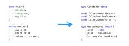

# [witigo](https://github.com/rioam2/witigo) &middot; [](https://github.com/rioam2/witigo/blob/main/LICENSE) [](https://github.com/rioam2/witigo?tab=readme-ov-file#contributing)  [](https://codecov.io/github/rioam2/witigo)


Command line tool and library for generating host bindings in golang for WebAssembly (WASM) Components. This is useful for building applications that consume WebAssembly modules that leverage high-level component types defined in WIT (WebAssembly Interface Types).

This project aims to provide a full implementation of the WebAssembly Component Model for usage in Golang host runtimes, including support for all WIT types and function signatures. See [CanonicalABI.md](./docs/CanonicalABI.md) for details on the canonical ABI used as a source of truth for implementation business logic.

Here is an example of how `witigo` transforms a WIT type into its corresponding Go type:



Function signatures are also transformed to use the generated types. For more details, build and view the examples in the `./examples` directory.

---

## Getting Started

To generate host bindings for a WebAssembly Component, build the project locally or download a prebuilt binary from the releases page. To build the project locally, ensure you have go1.24 or higher installed, as well as [Taskfile](https://taskfile.dev/):

```sh
# Build the project. Output binary in `./bin/witigo`
task build
```

Then, you can generate a new golang package from a WebAssembly Component by running the following command:

```sh
./bin/witigo generate <path_to_wasm_component> <output_directory>
```

The generated package will include all necessary bindings and types to interact with the WebAssembly Component. By default, Wazero is used to provide a WebAssembly Runtime. The output structure will look something like:

```txt
<output_directory>/
├── example_component_core.wasm
└── example_component.go
```

---

## Features and Roadmap

- [x] Required utilities for generating host bindings
  - [x] `AlignTo(ptr, alignment)` - Aligns a pointer to the specified alignment.
  - [x] `AlignmentOf(type)` - Returns the alignment of a given type.
  - [x] `SizeOf(type)` - Returns the size of an element of a given type.
- [ ] Lowering (writing) and lifting (reading) of interface types
  - [x] `Read(type)` - Lifts a type to its host representation.
    - [x] `s8`, `s16`, `s32`, `s64`
    - [x] `u8`, `u16`, `u32`, `u64`
    - [x] `f32`, `f64`
    - [x] `bool`
    - [x] `string`
    - [x] `list`
    - [x] `record`
    - [x] `option`
    - [x] `variant`
    - [ ] `result`
    - [ ] `tuple`
    - [ ] `flags`
    - [x] `enum`
  - [x] `Write(type)` - Lowers a type to its WebAssembly representation.
    - [x] `s8`, `s16`, `s32`, `s64`
    - [x] `u8`, `u16`, `u32`, `u64`
    - [x] `f32`, `f64`
    - [x] `bool`
    - [x] `string`
    - [x] `list`
    - [x] `record`
    - [x] `option`
    - [x] `variant`
    - [ ] `result`
    - [ ] `tuple`
    - [ ] `flags`
    - [x] `enum`
- [ ] Host binding code generation
  - [x] Generate type definitions for interface types
  - [x] Generate exported function bindings
  - [ ] Generate imported function bindings
  - [ ] Allow configuration of Wazero runtime on instantiation
- [ ] Devops
  - [x] Github Workflows actions to run tests
  - [ ] Dockerfile for building and running the tool
  - [ ] Automated releases using Release Please
  - [ ] Publishing prebuilt binaries on Releases

---

### Contributing

Contributions are welcome! Please feel free to submit a pull request or open an issue for any suggestions or improvements.

---

### License

This project is licensed under the MIT License. See the LICENSE file for more details.
